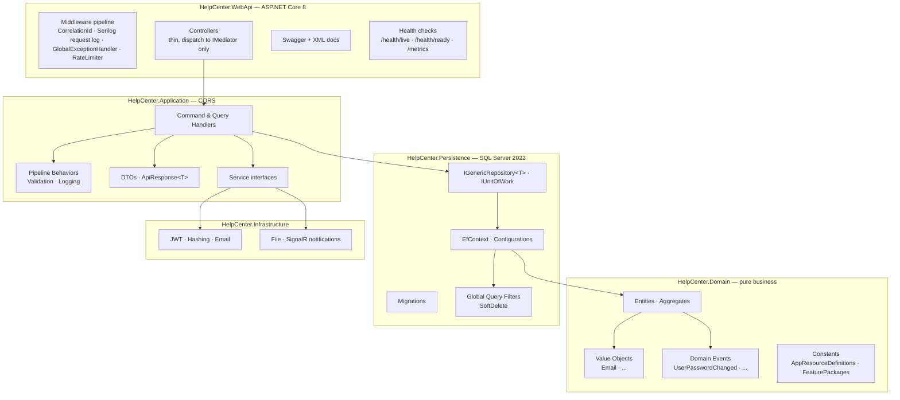
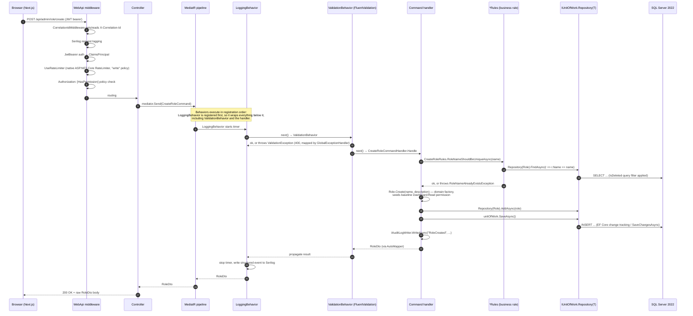
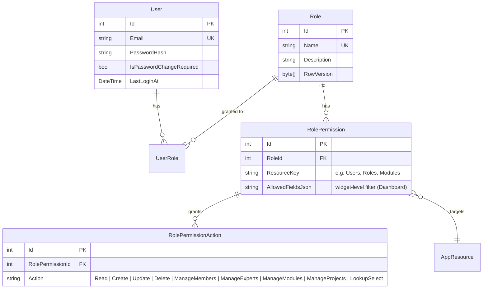
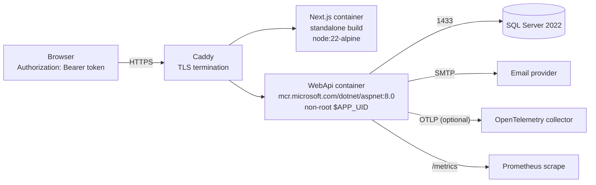

# Architecture

**Style:** Clean Architecture (pragmatic interpretation) + CQRS via MediatR
**Runtime:** ASP.NET Core 8 on Kestrel, containerized (Debian-based `aspnet:8.0` runtime image — see §4)
**Data:** SQL Server 2022 via EF Core 9
**Front-end:** Next.js 16 (App Router, React 19, Tailwind 4)

---

## 1. Layer map



**Dependency rule (enforced by `NetArchTest` in `HelpCenter.ArchitectureTests`):**

- `Domain` references **nothing** external (no EF, no ASP.NET, no third-party).
- `Application` references `Domain` only. **Never** `Persistence` or `WebApi`.
- `Persistence` references `Domain` + `Application` (implements the abstractions).
- `WebApi` composes everything, but controllers may only use `IMediator` (no `DbContext`, no repositories directly).

Violations break the build.

**Feature slices** (`HelpCenter.Application/Features/*`, one folder per bounded capability,
each with its own `Commands/`, `Queries/`, DTOs, validators and `*Rules`): `Auth`, `Companies`,
`Customers`, `Faqs`, `Guides`, `Menu`, `Modules`, `Organization`,
`Projects`, `Requests`, `RequestSubjects`, `Roles`, `Statistics`, `Status`/`Statuses`, `Users`.
A few of these have no prior coverage in this document:

- **Faqs (SSS)** — knowledge-base entries scoped to a `Project` and/or `Module` (both
  `ProjectId` and `ModuleId`), not a flat/independent list.
- **Guides** — help articles/video guides (optional `YoutubeUrl`), chainable via
  `PreviousGuideId`/`NextGuideId`, scoped to a `Project`.
- **Menu** — the admin sidebar's structure lives in the DB (`MenuItem`: label, icon, route,
  `ResourceKey`, parent/children, order), not hard-coded in the frontend; a menu item is only
  shown to a user who holds the permission for its `ResourceKey`.
- **Organization** — a singleton `OrganizationInfo` record (name, logo, contact info, tax info,
  footer text) used to white-label the portal.
- **Statistics** — admin dashboard reports/aggregate queries (`GetAdminStatistics`,
  `GetAdminReports`).

---

## 2. Request lifecycle (write path)

Traced end-to-end against a real slice — `CreateRoleCommand`
(`HelpCenter.Application/Features/Roles/Commands/CreateRole/`) — rather than an idealized example.
Routes are **not** versioned (no `/api/v1` prefix anywhere in the codebase); this endpoint is
`POST /api/admin/role/create`.



**What the diagram intentionally does *not* claim, because the code doesn't do it:**

- **No `ApiResponse<T>` envelope on success.** Controllers return `Ok(dto)` directly — the DTO is
  the response body. `ApiResponse<T>` is only used (a) by `GlobalExceptionHandler` for **every
  error** response, and (b) by the two `AuthTokenController` endpoints. Most success responses
  are unwrapped.
- **No `201 Created`.** Create endpoints return `200 OK`, not `201` — there is no
  `CreatedAtAction` anywhere in the controllers.
- **No typed repository accessors** (`uow.Roles`, `uow.Users`, ...). Everything goes through the
  single generic `IUnitOfWork.Repository<T>()`.
- **No custom `RateLimitingMiddleware`/`ExceptionMiddleware` classes.** Rate limiting is the
  native ASP.NET Core `RateLimiter` (`AddRateLimiter`/`UseRateLimiter`, policies `auth`/`public`/
  `password`/`write`/`upload`/`heavy` + a global fallback); error handling is the native
  `IExceptionHandler` (`GlobalExceptionHandler`), not a hand-rolled middleware.
- **Access token storage is intentionally memory-only.** The API returns a short-lived access token
  in its response body; the frontend keeps it in `authSession`, not browser storage. A rotating
  `refresh_token` is instead an `HttpOnly`, `Secure`, `SameSite=Lax` cookie. The edge proxy can
  only use that cookie as a coarse route gate, while protected layouts verify the refreshed access
  token and permissions through the API.

---

## 3. RBAC model



**Why action-list instead of boolean columns:**

- Boolean columns (`CanRead`, `CanCreate`, ...) require a schema change every time a new contextual action appears (e.g. `ManageMembers`, `LookupSelect`).
- Action-list makes the permission set **open for extension, closed for modification** — new actions just insert rows.
- Feature packages become trivial: a preset is a set of `(ResourceKey, Action[])` tuples applied atomically.

## 4. Deployment topology



`docker-compose.prod.yml` exposes only Caddy on ports 80/443. Caddy obtains TLS certificates for
`APP_DOMAIN`, then routes `/api/*`, `/requestHub*`, and `/health/*` to the API and all other traffic to Next.js.
The API and SQL Server remain private to the Docker network. Production startup reads
`SA_PASSWORD`, `JwtSettings__SecretKey`, the complete `SmtpSettings__*` set,
`NEXT_PUBLIC_API_URL`, `NEXT_PUBLIC_APP_URL`, `AppSettings__FrontendUrl`, `APP_DOMAIN`, and
`ACME_EMAIL` from the ignored root `.env`; connection, JWT-secret, SMTP, and origin settings have
no committed fallback.
Development uses the same file and keeps direct localhost ports for local debugging.

- **Backend image is not Alpine.** The `HelpCenter.WebApi/Dockerfile` builds `FROM
  mcr.microsoft.com/dotnet/aspnet:8.0` (the Debian-based runtime image), not an `-alpine` variant.
  It does run as the non-root `$APP_UID` user. The **frontend** image genuinely is
  `node:22-alpine`.
- **Images are multi-stage** and their build contexts exclude local environment files, build output,
  logs, and uploads through service-specific `.dockerignore` files.
- OpenTelemetry OTLP trace export is optional (enabled only when `Otel:OtlpEndpoint` is
  configured); the Prometheus metrics endpoint (`/metrics`, via `MapPrometheusScrapingEndpoint()`)
  is always exposed regardless — see §5.

## 5. Cross-cutting concerns

| Concern | Where it lives | Notes |
|---|---|---|
| Logging | Serilog + `LoggingBehavior<TReq,TRes>` | Structured request outcome logging to the configured rolling file sink. The behavior is registered *first*, so it wraps `ValidationBehavior` and the handler. It does not serialize request bodies or write operational logs to the database. |
| Validation | FluentValidation + `ValidationBehavior<TReq,TRes>` | Fails fast, mapped to 400 by `GlobalExceptionHandler` |
| Errors | `GlobalExceptionHandler` (`IExceptionHandler`, `.NET 8` native — registered via `AddGlobalExceptionHandling()` / `app.UseExceptionHandler()`) | Sanitizes exceptions → `ApiResponse<T>` envelope, HTTP code by exception type. There is no separate `ExceptionMiddleware` class. |
| Auth | JWT bearer + custom `PermissionHandler`/`PermissionPolicyProvider` | Policy name is `"{Module}.{Action}"` (e.g. `"Roles.Delete"`), built dynamically by `PermissionPolicyProvider.GetPolicyAsync` from any policy string containing a `.` — not the `Perm:{Resource}:{Action}` format previously documented here. |
| Correlation | `CorrelationIdMiddleware` | Reads/generates `X-Correlation-Id`, pushed into Serilog log context |
| Rate limit | ASP.NET Core's native `RateLimiter` (`AddRateLimiter`/`UseRateLimiter`, no custom middleware class) | Partitioned by user id (or client IP as fallback). Named policies: `auth` 5/30s, `password` 3/5min, `public` 60/1min, `write` 30/1min, `upload` 15/1min, `heavy` 30/1min, plus a 200/1min global fallback. |
| Security headers | `SecurityHeadersMiddleware` (`HelpCenter.WebApi/Middleware/SecurityHeadersMiddleware.cs`) | Registered in the HTTP pipeline; supplies CSP/HSTS/X-Frame-Options and related headers. |
| Config | Strongly-typed `*Options` classes | `ValidateDataAnnotations().ValidateOnStart()` — bad config = fail to boot |
| Health / metrics | ASP.NET Core Health Checks + `AspNetCore.HealthChecks.SqlServer`; OpenTelemetry SDK (tracing + metrics) with a Prometheus scrape endpoint | `/health/live` (self), `/health/ready` (DB); `/metrics` (Prometheus, via `MapPrometheusScrapingEndpoint()`) is always on; OTLP trace export is optional, enabled only when `Otel:OtlpEndpoint` is configured. |

## 6. Testing pyramid

```
       ▲  E2E  (Playwright, planned)
       │
     Integration  (Testcontainers.MsSql + WebApplicationFactory)
       │
    Application unit  (xUnit + NSubstitute + EF InMemory)
       │
   Architecture  (NetArchTest — layers, naming)
```

Architecture tests are the base of the pyramid — they run in seconds and enforce structural rules that would otherwise decay over months.

## 7. Related documents

- [Tech stack — package-by-package rationale](tech-stack.md)
- [ADR index](adr/)
