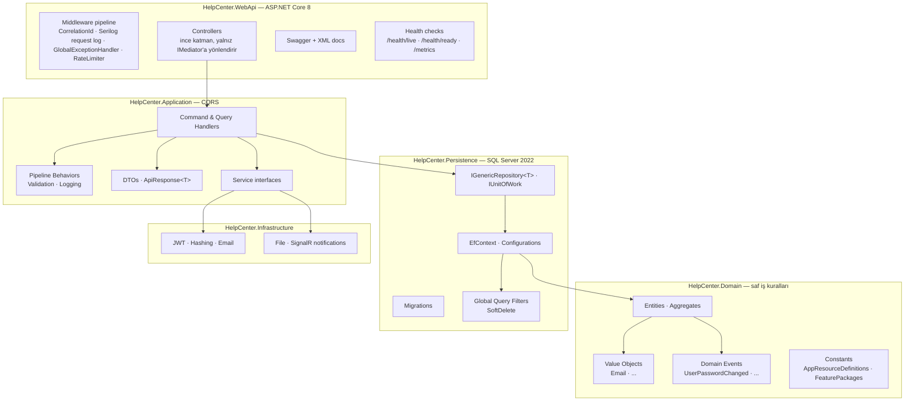

<!-- Canonical source: architecture.md. Keep this translation aligned with the English document. -->

# Mimari

[English](architecture.md) · [Türkçe](architecture.tr.md)

**Stil:** Pragmatik Clean Architecture + MediatR ile CQRS
**Çalışma zamanı:** Kestrel üzerinde ASP.NET Core 8; container içi (Debian tabanlı `aspnet:8.0`)
**Veri:** EF Core 9 ile SQL Server 2022
**İstemci:** Next.js 16 (App Router, React 19, Tailwind 4)

---

## 1. Katman haritası

`HelpCenter.ArchitectureTests` içindeki NetArchTest kuralları bağımlılık yönünü CI'da uygular:

- `Domain` dış bağımlılık almaz; EF, ASP.NET ve üçüncü taraf paketi referanslamaz.
- `Application` yalnız `Domain`i referanslar; `Persistence` veya `WebApi`yi asla referanslamaz.
- `Persistence`, soyutlamaları uygulamak için `Domain` + `Application`ı referanslar.
- `WebApi` her şeyi compose eder; controller'lar yalnız `IMediator` kullanır, doğrudan `DbContext`
  veya repository kullanmaz. İhlal build'i kırar.

Feature slice'lar `HelpCenter.Application/Features/*` altındadır; her bounded capability kendi
`Commands/`, `Queries/`, DTO, validator ve `*Rules` alanına sahiptir. `Faqs` proje/modül kapsamlı
bilgi bankası kaydıdır; `Guides` proje kapsamlı, öncül/ardıl zincirli makale/video rehberdir;
`Menu` DB'deki dinamik sidebar yapısıdır ve kullanıcı yalnız `ResourceKey` yetkisi olan menüyü
görür. `Organization` singleton white-label kurum profilini, `Statistics` admin aggregate raporlarını taşır.

## 2. İstek yaşam döngüsü (yazma yolu)

Gerçek bir slice olan `CreateRoleCommand` üzerinden akış şöyledir; route sürümlenmez ve endpoint
`POST /api/admin/role/create`dir:

1. Browser JWT bearer isteğini gönderir; middleware `X-Correlation-Id`yi kurar, Serilog'a istek
   olayı yazar, claims'i doğrular, native rate limit ve `[HasPermission]` policy'sini uygular.
2. İnce controller `mediator.Send(CreateRoleCommand)` çağırır. Kayıt sırasına göre `LoggingBehavior`
   dış sarmaldır; `ValidationBehavior` ve handler'ı sarar.
3. Validation başarısızsa `GlobalExceptionHandler`ın 400'e çevirdiği exception oluşur. Başarılıysa
   handler business rule ile rol adını kontrol eder, generic repository ve SQL Server üzerinden sorgular.
4. Handler `Role.Create` ile entity üretir, baseline `Dashboard:Read` iznini ekler, repository'ye
   koyup `unitOfWork.SaveAsync()` çağırır. Audit olayı `IAuditLogWriter.WriteAsync("RoleCreated", ...)`
   ile aynı iş akışında yazılır.
5. AutoMapper `RoleDto` üretir; logging süresini ve yapılandırılmış sonucu dosya sink'ine yazar;
   controller ham `RoleDto` gövdesiyle `200 OK` döndürür.

Bu akışın özellikle **iddia etmediği** noktalar: create endpointleri `201` değil `200` döndürür;
başarılı cevapların çoğunda `ApiResponse<T>` zarfı yoktur; typed `uow.Roles` accessor'ı yoktur;
rate limit native `RateLimiter`, hata yönetimi native `IExceptionHandler`dır. Access token yalnız
`authSession` belleğindedir; rotating `refresh_token` ise `HttpOnly`, `Secure`, `SameSite=Lax`
cookie'dir ve edge proxy yalnız kaba rota geçidi olarak kullanır.

## 3. RBAC modeli

Action-list modelinde `RolePermission (RoleId, ResourceKey)` rol-kaynak çifti için tek satır,
`RolePermissionAction (RolePermissionId, Action)` ise verilen her aksiyon için bir satırdır.
Boolean `CanRead`/`CanCreate` kolonları yeni bağlamsal aksiyonlarda şema değişikliği gerektirirken,
action-list yalnız `AppResourceDefinitions`a yeni aksiyon ekler. Feature package, atomik uygulanan
`(ResourceKey, Action[])` tuple setidir.

## 4. Dağıtım topolojisi

Browser HTTPS ile TLS termination yapan Caddy'ye bağlanır. Caddy `/api/*`, `/requestHub*` ve
`/health/*`i API'ye, kalan trafiği Next.js'e yollar. API SQL Server'a 1433 üzerinden ulaşır; SMTP,
isteğe bağlı OTLP trace export ve Prometheus `/metrics` çıkışları vardır. Production compose yalnız
Caddy'nin 80/443 portlarını açar; API ile SQL Server Docker ağı içinde private kalır.

Production için kökteki `.env`de `SA_PASSWORD`, `JwtSettings__SecretKey`, tüm `SmtpSettings__*`
anahtarları, `NEXT_PUBLIC_API_URL`, `NEXT_PUBLIC_APP_URL`, `AppSettings__FrontendUrl`, `APP_DOMAIN`,
`ACME_EMAIL` gerekir; connection, JWT secret, SMTP ve origin ayarları için committed fallback yoktur.
Development da aynı dosyayı kullanır. Backend `mcr.microsoft.com/dotnet/aspnet:8.0`
(Debian) üzerinde non-root `$APP_UID` ile, frontend gerçek `node:22-alpine` üzerinde çalışır. İmajlar
multi-stage'dir; service-specific `.dockerignore` secret, build output, log ve uploadları dışlar.
OTLP trace export yalnız `Otel:OtlpEndpoint` varsa aktiftir; Prometheus `/metrics` her ortamda açıktır.

## 5. Kesitsel konular

| Konu | Konumu | Not |
|---|---|---|
| Loglama | Serilog + `LoggingBehavior<TReq,TRes>` | Request body serileştirmeden, yapılandırılmış sonuç logu rolling dosya sink'ine gider; DB'ye operasyon logu yazmaz. |
| Validation | FluentValidation + `ValidationBehavior` | Fast fail; `GlobalExceptionHandler` 400'e eşler. |
| Hatalar | `GlobalExceptionHandler` (`IExceptionHandler`) | Exception'ı sanitize edip `ApiResponse<T>` ve türüne göre HTTP code üretir; ayrı `ExceptionMiddleware` yoktur. |
| Auth | JWT + `PermissionHandler`/`PermissionPolicyProvider` | Policy adı `"{Module}.{Action}"` biçimindedir; örnek `Roles.Delete`. |
| Correlation | `CorrelationIdMiddleware` | `X-Correlation-Id` üretir/okur ve Serilog context'ine iter. |
| Rate limit | Native ASP.NET Core `RateLimiter` | Kullanıcı id veya IP ile partition; auth 5/30s, password 3/5dk, public 60/dk, write/heavy 30/dk, upload 15/dk, global 200/dk. |
| Security headers | `SecurityHeadersMiddleware` | CSP, HSTS, X-Frame-Options ve ilişkili başlıkları ekler. |
| Config | Strongly typed `*Options` | `ValidateDataAnnotations().ValidateOnStart()`; geçersiz config boot'u durdurur. |
| Health/metrics | Health Checks + OTel + Prometheus | `/health/live` süreç, `/health/ready` DB, `/metrics` Prometheus endpointidir. |

## 6. Test piramidi

Architecture (NetArchTest) saniyeler içinde isimlendirme/katman kuralını uygular. Application birim
testleri xUnit, NSubstitute, EF InMemory ile iş kurallarını; WebApi integration testleri
Testcontainers.MsSql ve WebApplicationFactory ile gerçek SQL Server, migration, query filter ve
transaction davranışını doğrular. Playwright E2E üst katmandır. Mimari testleri tabandır; zamanla
çürüyecek yapısal kuralları erken yakalar.

## 7. İlgili belgeler

- [Teknoloji yığını — paket bazlı gerekçe](tech-stack.tr.md)
- [ADR indeksi](adr/README.tr.md)
