# Database Schema Reference

This document describes the SQL Server schema produced by the current EF Core
model. It is a reference for developers and operators; migrations remain the
authoritative way to change the schema.

**Model source:** `HelpCenter.Persistence/Context/EfContext.cs` and migration
`20260919092938_RemoveAppLogsAndHardenAuditTrail`.

## Entity relationship diagram

The diagram shows database foreign keys. It deliberately omits application-only
references such as `AuditLogs.ActorUserId`, which is not a database foreign key.

```mermaid
erDiagram
    Accounts ||--o| Users : "Users.AccountId"
    Accounts ||--o| Customers : "Customers.AccountId"
    Companies ||--o{ Customers : "Customers.CompanyId"
    Projects o|--o{ Companies : "Companies.ProjectId"

    Users ||--o{ UserRoles : "UserRoles.UserId"
    Roles ||--o{ UserRoles : "UserRoles.RoleId"
    Roles ||--o{ RolePermissions : "RolePermissions.RoleId"
    RolePermissions ||--o{ RolePermissionActions : "RolePermissionActions.RolePermissionId"
    Users ||--o{ UserProjects : "UserProjects.UserId"
    Projects ||--o{ UserProjects : "UserProjects.ProjectId"

    Companies ||--o{ CompanyModule : "CompanyModule.CompanyId"
    Modules ||--o{ CompanyModule : "CompanyModule.ModuleId"
    Projects ||--o{ ProjectModule : "ProjectModule.ProjectId"
    Modules ||--o{ ProjectModule : "ProjectModule.ModuleId"
    Modules ||--o{ ModuleExperts : "ModuleExperts.ModuleId"
    Users ||--o{ ModuleExperts : "ModuleExperts.UserId"

    Customers ||--o{ CustomerRequests : "CustomerRequests.CustomerId"
    CustomerRequestStatuses ||--o{ CustomerRequests : "CustomerRequests.StatusId"
    RequestSubjects o|--o{ CustomerRequests : "CustomerRequests.RequestSubjectId"
    Modules o|--o{ CustomerRequests : "CustomerRequests.ModuleId"
    Users o|--o{ CustomerRequests : "AssignedUserId / CurrentExpertId"
    Conversations o|--o| CustomerRequests : "CustomerRequests.ConversationId"
    CustomerRequests ||--o{ CustomerRequestEvaluations : "CustomerRequestId"
    CustomerRequests ||--o{ RequestHistories : "RequestId"
    Accounts ||--o{ RequestHistories : "ActorAccountId"

    Conversations ||--o{ ConversationParticipants : "ConversationId"
    Users o|--o{ ConversationParticipants : "UserId"
    Customers o|--o{ ConversationParticipants : "CustomerId"
    Conversations ||--o{ CustomerRequestMessages : "ConversationId"
    ConversationParticipants ||--o{ CustomerRequestMessages : "SenderParticipantId"
    CustomerRequests ||--o{ CustomerRequestDocuments : "CustomerRequestId"
    CustomerRequestMessages o|--o{ CustomerRequestDocuments : "CustomerRequestMessageId"

    Projects o|--o{ RequestSubjects : "ProjectId"
    Modules o|--o{ RequestSubjects : "ModuleId"
    Projects o|--o{ CustomerRequestStatuses : "ProjectId"
    Projects o|--o{ FAQs : "ProjectId"
    Modules o|--o{ FAQs : "ModuleId"
    Projects o|--o{ Guides : "ProjectId"
    Guides o|--o| Guides : "PreviousGuideId"
    Guides ||--o{ Documents : "GuideId"
    MenuItems o|--o{ MenuItems : "ParentId"
    Users o|--o{ RefreshTokens : "UserId"
    Customers o|--o{ RefreshTokens : "CustomerId"
```

## Table guide

| Area | Tables | Purpose |
|---|---|---|
| Identity | `Accounts`, `Users`, `Customers`, `RefreshTokens` | `Accounts` holds credentials and profile data. Staff `User` and customer `Customer` records each refer to an account; customers also belong to a company. Refresh tokens store only a SHA-256 hash, never the raw token. |
| Authorization and scope | `Roles`, `UserRoles`, `RolePermissions`, `RolePermissionActions`, `UserProjects` | Action-list RBAC: a role has resource permissions, each permission has action rows (for example `Read`). `UserProjects` grants project scope. |
| Tenant/catalog | `Projects`, `Companies`, `Modules`, `ProjectModule`, `CompanyModule`, `ModuleExperts` | Projects organize companies and catalogue content. The two singularly-named link tables represent project/module and company/module membership; `ModuleExperts` assigns staff expertise to a module. |
| Ticketing | `CustomerRequests`, `CustomerRequestStatuses`, `RequestSubjects`, `RequestHistories`, `CustomerRequestEvaluations` | A customer creates a ticket with a required status and optional module, subject, assignee, expert and conversation. Histories record ticket actions; evaluations retain feedback/status-change context. |
| Conversation and files | `Conversations`, `ConversationParticipants`, `CustomerRequestMessages`, `CustomerRequestDocuments` | A conversation has participants and messages. An uploaded file always belongs to a ticket and can optionally be attached to a message. |
| Knowledge base | `Guides`, `Documents`, `FAQs` | Guides can form a one-to-one predecessor/successor chain and own uploaded documents. FAQs can be scoped to a project and/or module. |
| Configuration and evidence | `MenuItems`, `OrganizationInfos`, `AuditLogs` | Dynamic navigation, organization profile, and append-only forensic audit events. |

### Table-level detail

| Table | What it represents | Foreign keys / relationship direction |
|---|---|---|
| `Accounts` | Login identity, credential hash and profile fields shared by staff and customers. | Principal of optional one-to-one `Users` and `Customers` records. |
| `Users` | Internal staff identity. | Required `AccountId` → `Accounts`; joins roles, projects and module expertise. |
| `Customers` | Customer identity for a company. | Required `AccountId` → `Accounts`; required `CompanyId` → `Companies`; owns tickets. |
| `Companies` | Customer organization and contact information. | Optional `ProjectId` → `Projects`; parent of customers and company-module links. |
| `Projects` | Product/project grouping. | Parent of companies, user/project and project/module links; optional scope for knowledge and ticket reference data. |
| `Modules` | Functional product module. | Parent of company/project membership and expert assignment links; optional ticket and reference scope. |
| `CompanyModule` | Company-to-module membership. | Required `CompanyId` → `Companies`, `ModuleId` → `Modules`. |
| `ProjectModule` | Project-to-module membership. | Required `ProjectId` → `Projects`, `ModuleId` → `Modules`. |
| `ModuleExperts` | Staff members qualified for a module. | Required `ModuleId` → `Modules`, `UserId` → `Users`. |
| `Roles` | Named RBAC role. | Parent of user-role and role-permission links. |
| `UserRoles` | Staff-to-role assignment. | Required `UserId` → `Users`, `RoleId` → `Roles`. |
| `RolePermissions` | A role's permission for one resource key. | Required `RoleId` → `Roles`; parent of action rows. |
| `RolePermissionActions` | An allowed action for a role-resource permission. | Required `RolePermissionId` → `RolePermissions`. |
| `UserProjects` | A staff member's project scope. | Required `UserId` → `Users`, `ProjectId` → `Projects`. |
| `CustomerRequests` | Support ticket. | Required `CustomerId` → `Customers`, `StatusId` → `CustomerRequestStatuses`; optional subject, module, assigned user, expert and conversation references. |
| `CustomerRequestStatuses` | Ticket status definition, optionally project-specific. | Optional `ProjectId` → `Projects`; referenced by tickets. |
| `RequestSubjects` | Ticket subject/category, optionally project/module-specific. | Optional `ProjectId` → `Projects`, `ModuleId` → `Modules`; referenced by tickets. |
| `RequestHistories` | Per-ticket action history with the acting account. | Required `RequestId` → `CustomerRequests`, `ActorAccountId` → `Accounts`. |
| `CustomerRequestEvaluations` | Customer feedback and status-transition context for a ticket. | Required `CustomerRequestId` → `CustomerRequests`. |
| `Conversations` | Message thread used by ticket communication. | Parent of participants and messages; referenced optionally from `CustomerRequests`. |
| `ConversationParticipants` | A staff or customer participant in a conversation. | Required `ConversationId` → `Conversations`; optional `UserId` → `Users` or `CustomerId` → `Customers`. |
| `CustomerRequestMessages` | Individual conversation message. | Required `ConversationId` → `Conversations`, `SenderParticipantId` → `ConversationParticipants`. |
| `CustomerRequestDocuments` | Uploaded ticket file; may be linked to a specific message. | Required `CustomerRequestId` → `CustomerRequests`; optional `CustomerRequestMessageId` → `CustomerRequestMessages`. |
| `Guides` | Knowledge-base guide. | Optional `ProjectId` → `Projects`; optional one-to-one `PreviousGuideId` → `Guides`; parent of documents. |
| `Documents` | File attached to a guide. | Required `GuideId` → `Guides`. |
| `FAQs` | Frequently asked question, optionally project/module-scoped. | Optional `ProjectId` → `Projects`, `ModuleId` → `Modules`. |
| `MenuItems` | Dynamic admin navigation entry. | Optional `ParentId` → `MenuItems` for a menu tree. |
| `OrganizationInfos` | Organization profile/configuration. | No database foreign keys; treated by the application as a singleton profile. |
| `RefreshTokens` | Rotatable, revocable session token record. | Optional `UserId` → `Users` or `CustomerId` → `Customers`. |
| `AuditLogs` | Forensic record of an audited business event. | No enforced foreign keys: actor and target IDs are retained as evidence even if related data changes. |

## Integrity, lifecycle and performance rules

### Common entity columns

Every table except `AuditLogs` and `RefreshTokens` derives from `BaseEntity` and
therefore includes an integer primary key plus `PublicId`, timestamps,
`IsActive`, `IsDeleted`, actor-reference columns and a `RowVersion` concurrency
token. `PublicId` is a unique `GUID` used as the external identity. EF applies a
global `IsDeleted = false` filter to these entities, so normal application
queries exclude soft-deleted rows.

`AuditLogs` and `RefreshTokens` use `bigint` primary keys and do not participate
in that soft-delete filter. Do not assume `CreatedByAccountId` or
`LastModifiedByAccountId` is an FK: they are stored scalar values, not enforced
relationships in this model.

### Delete behavior

- Link rows (`CompanyModule`, `ProjectModule`, `ModuleExperts`, `UserProjects`,
  `UserRoles`, RBAC action rows) cascade when their required parent is deleted.
- Ticket-owned data (`CustomerRequestEvaluations`, `RequestHistories`, ticket
  documents) cascades from the ticket. Conversation messages and participants
  cascade from the conversation.
- Conversation participant user/customer links and `RequestHistories.ActorAccountId`
  are `RESTRICT`; referenced identities cannot be physically removed first.
- `Companies.ProjectId` and `CustomerRequests.ConversationId` are set to `NULL`
  when their target is deleted. FAQ relationships and the guide predecessor
  relationship are `RESTRICT`.
- In ordinary product flows, `BaseEntity` tables are soft-deleted instead of
  physically deleted. The database delete behaviors chiefly protect integrity
  for explicit physical deletes and migration/maintenance work.

### Important indexes and constraints

- Every `BaseEntity` table has a unique `PublicId` index.
- `Accounts.Email` and `Accounts.Username` are unique.
- `RefreshTokens.TokenHash` is unique; `(UserId, ExpiresAt)` and
  `(CustomerId, ExpiresAt)` support session cleanup/lookups.
- `RolePermissionActions` has a unique `(RolePermissionId, Action)` index, so
  an action cannot be granted twice for the same role-resource permission.
- `AuditLogs` is indexed by `(EventType, OccurredAt)`, `(ActorUserId,
  OccurredAt)` and `(TargetType, TargetId)` for investigations.
- Foreign-key columns have indexes generated by the EF model to support joins
  and filtered ticket queries.

### Audit evidence

`AuditLogs` is intentionally append-only in SQL Server. Migration
`20260919092938_RemoveAppLogsAndHardenAuditTrail` installs
`dbo.TR_AuditLogs_AppendOnly`, which throws on `UPDATE` and `DELETE`. Inserts
remain permitted. The trigger protects against ordinary application and client
changes; a sufficiently privileged database administrator can still alter
database objects, so it is not a substitute for restricting DBA access or
external evidence retention where that threat model applies.

## Keeping this document current

When a migration changes a table, foreign key, delete behavior, index or the
audit trigger, update this document in the same change. Check the EF model and
the generated migration rather than inferring the database from application
DTOs or navigation-property names.
