<!-- Canonical source: database-schema.md. Keep this translation aligned with the English document. -->

# Veritabanı Şeması Referansı

[English](database-schema.md) · [Türkçe](database-schema.tr.md)

Bu belge güncel EF Core modelinin ürettiği SQL Server şemasını açıklar. Geliştiriciler ve
operatörler için referanstır; şemayı değiştirmede migration'lar otoriter kaynaktır.

**Model kaynağı:** `HelpCenter.Persistence/Context/EfContext.cs` ve
`20260919092938_RemoveAppLogsAndHardenAuditTrail` migration'ı.

## Varlık-ilişki diyagramı

Diyagram veritabanı foreign key'lerini gösterir. `AuditLogs.ActorUserId` gibi uygulama düzeyi,
veritabanı foreign key'i olmayan referansları özellikle göstermez.

```mermaid
erDiagram
    Accounts ||--o| Users : "Users.AccountId"
    Accounts ||--o| Customers : "Customers.AccountId"
    Companies ||--o{ Customers : "Customers.CompanyId"
    Projects o|--o{ Companies : "Companies.ProjectId"

    Users ||--o{ UserRoles : "UserRoles.UserId"
    Roles ||--o{ UserRoles : "UserRoles.RoleId"
    Roles ||--o{ RolePermissions : "RolePermissions.RoleId"
    RolePermissions ||--o{ RolePermissionActions : "RolePermissionActions.RolePermissionId"
    Users ||--o{ UserProjects : "UserProjects.UserId"
    Projects ||--o{ UserProjects : "UserProjects.ProjectId"

    Companies ||--o{ CompanyModule : "CompanyModule.CompanyId"
    Modules ||--o{ CompanyModule : "CompanyModule.ModuleId"
    Projects ||--o{ ProjectModule : "ProjectModule.ProjectId"
    Modules ||--o{ ProjectModule : "ProjectModule.ModuleId"
    Modules ||--o{ ModuleExperts : "ModuleExperts.ModuleId"
    Users ||--o{ ModuleExperts : "ModuleExperts.UserId"

    Customers ||--o{ CustomerRequests : "CustomerRequests.CustomerId"
    CustomerRequestStatuses ||--o{ CustomerRequests : "CustomerRequests.StatusId"
    RequestSubjects o|--o{ CustomerRequests : "CustomerRequests.RequestSubjectId"
    Modules o|--o{ CustomerRequests : "CustomerRequests.ModuleId"
    Users o|--o{ CustomerRequests : "AssignedUserId / CurrentExpertId"
    Conversations o|--o| CustomerRequests : "CustomerRequests.ConversationId"
    CustomerRequests ||--o{ CustomerRequestEvaluations : "CustomerRequestId"
    CustomerRequests ||--o{ RequestHistories : "RequestId"
    Accounts ||--o{ RequestHistories : "ActorAccountId"

    Conversations ||--o{ ConversationParticipants : "ConversationId"
    Users o|--o{ ConversationParticipants : "UserId"
    Customers o|--o{ ConversationParticipants : "CustomerId"
    Conversations ||--o{ CustomerRequestMessages : "ConversationId"
    ConversationParticipants ||--o{ CustomerRequestMessages : "SenderParticipantId"
    CustomerRequests ||--o{ CustomerRequestDocuments : "CustomerRequestId"
    CustomerRequestMessages o|--o{ CustomerRequestDocuments : "CustomerRequestMessageId"

    Projects o|--o{ RequestSubjects : "ProjectId"
    Modules o|--o{ RequestSubjects : "ModuleId"
    Projects o|--o{ CustomerRequestStatuses : "ProjectId"
    Projects o|--o{ FAQs : "ProjectId"
    Modules o|--o{ FAQs : "ModuleId"
    Projects o|--o{ Guides : "ProjectId"
    Guides o|--o| Guides : "PreviousGuideId"
    Guides ||--o{ Documents : "GuideId"
    MenuItems o|--o{ MenuItems : "ParentId"
    Users o|--o{ RefreshTokens : "UserId"
    Customers o|--o{ RefreshTokens : "CustomerId"
```

## Tablo rehberi

| Alan | Tablolar | Amaç |
|---|---|---|
| Kimlik | `Accounts`, `Users`, `Customers`, `RefreshTokens` | `Accounts` kimlik bilgisi ve profil verisini tutar. Personel `User` ve müşteri `Customer` kayıtları hesaba; müşteriler ayrıca firmaya bağlanır. Refresh token'ın ham değeri değil yalnız SHA-256 hash'i saklanır. |
| Yetkilendirme ve kapsam | `Roles`, `UserRoles`, `RolePermissions`, `RolePermissionActions`, `UserProjects` | Action-list RBAC: rolün kaynak yetkileri, yetkinin aksiyon satırları vardır. `UserProjects` proje kapsamı verir. |
| Tenant/katalog | `Projects`, `Companies`, `Modules`, `ProjectModule`, `CompanyModule`, `ModuleExperts` | Projeler firmaları ve katalog içeriğini düzenler. İki tekil isimli link tablosu proje/modül ve firma/modül üyeliğini; `ModuleExperts` personel uzmanlığını tutar. |
| Talep | `CustomerRequests`, `CustomerRequestStatuses`, `RequestSubjects`, `RequestHistories`, `CustomerRequestEvaluations` | Müşteri zorunlu durumlu, isteğe bağlı modül/konu/atanan/uzman/konuşmalı talep oluşturur. Geçmiş eylemleri, değerlendirmeler geri bildirim ve durum geçişini saklar. |
| Konuşma ve dosyalar | `Conversations`, `ConversationParticipants`, `CustomerRequestMessages`, `CustomerRequestDocuments` | Konuşma katılımcı ve mesajlardan oluşur. Yüklenen dosya her zaman talebe aittir, isteğe bağlı olarak mesaja bağlanır. |
| Bilgi bankası | `Guides`, `Documents`, `FAQs` | Rehberler bire bir öncül/ardıl zinciri kurabilir ve belge sahibi olur. SSS proje ve/veya modül kapsamına alınabilir. |
| Yapılandırma ve kanıt | `MenuItems`, `OrganizationInfos`, `AuditLogs` | Dinamik navigasyon, kurum profili ve append-only adli denetim olayları. |

### Tablo düzeyi ayrıntı

| Tablo | Temsil ettiği şey | Foreign key / ilişki yönü |
|---|---|---|
| `Accounts` | Personel ve müşterinin ortak giriş kimliği, credential hash'i ve profil alanları. | İsteğe bağlı bire bir `Users` ve `Customers` kayıtlarının asıl kaydı. |
| `Users` | İç personel kimliği. | Zorunlu `AccountId` → `Accounts`; rol, proje ve modül uzmanlığına bağlanır. |
| `Customers` | Bir firmaya ait müşteri kimliği. | Zorunlu `AccountId` → `Accounts`, `CompanyId` → `Companies`; taleplerin sahibidir. |
| `Companies` | Müşteri kurumu ve iletişim bilgisi. | İsteğe bağlı `ProjectId` → `Projects`; müşteri ve firma-modül linklerinin üst kaydı. |
| `Projects` | Ürün/proje gruplaması. | Firma, kullanıcı/proje ve proje/modül linklerinin üst kaydı; bilgi ve talep referans verisine isteğe bağlı kapsam verir. |
| `Modules` | İşlevsel ürün modülü. | Firma/proje üyeliği ve uzman atamasının üst kaydı; talep ve referans kapsamı olabilir. |
| `CompanyModule` / `ProjectModule` | Firma/modül ve proje/modül üyeliği. | Sırasıyla zorunlu `CompanyId`/`ProjectId` ile `ModuleId` foreign key'leri. |
| `ModuleExperts` | Bir modülde yetkin personel. | Zorunlu `ModuleId` → `Modules`, `UserId` → `Users`. |
| `Roles`, `UserRoles` | Adlandırılmış RBAC rolü ve personele ataması. | Rol, kullanıcı-rol ve rol-yetki linklerinin üst kaydı; linkte zorunlu `UserId`/`RoleId` vardır. |
| `RolePermissions`, `RolePermissionActions` | Bir rolün kaynak yetkisi ve izinli aksiyonları. | `RoleId` → `Roles`; aksiyon satırında `RolePermissionId` → `RolePermissions`. |
| `UserProjects` | Personelin proje kapsamı. | Zorunlu `UserId` → `Users`, `ProjectId` → `Projects`. |
| `CustomerRequests` | Destek talebi. | Zorunlu müşteri ve durum; isteğe bağlı konu, modül, atanan kullanıcı, uzman ve konuşma. |
| `CustomerRequestStatuses`, `RequestSubjects` | Talep durum ve konu/kategori tanımı. | İsteğe bağlı proje; konuda ayrıca modül kapsamı; talepler tarafından referanslanır. |
| `RequestHistories`, `CustomerRequestEvaluations` | Talep eylem geçmişi ve müşteri geri bildirimi. | Geçmişte zorunlu talep ve eylemi yapan hesap; değerlendirmede zorunlu talep. |
| `Conversations`, `ConversationParticipants`, `CustomerRequestMessages` | Talep mesajlaşma zinciri. | Konuşma katılımcı/mesajların üst kaydıdır; katılımcı kullanıcı veya müşteri, mesaj gönderen katılımcıya bağlıdır. |
| `CustomerRequestDocuments` | Yüklenmiş talep dosyası. | Zorunlu talep, isteğe bağlı belirli mesaj bağlantısı. |
| `Guides`, `Documents`, `FAQs` | Bilgi bankası içerikleri. | Rehberin isteğe bağlı proje ve `PreviousGuideId` bağı, belgelerin zorunlu rehber bağı; SSS'nin isteğe bağlı proje/modül bağı vardır. |
| `MenuItems`, `OrganizationInfos` | Dinamik yönetim navigasyonu ve kurum profil/ayarları. | Menüde isteğe bağlı `ParentId` ile ağaç; kurum profilinde foreign key yoktur ve uygulama onu singleton sayar. |
| `RefreshTokens` | Döndürülebilir, iptal edilebilir oturum token kaydı. | İsteğe bağlı `UserId` → `Users` veya `CustomerId` → `Customers`. |
| `AuditLogs` | Denetlenen iş olayının adli kaydı. | Zorunlu foreign key yoktur; actor/target kimlikleri ilgili veri değişse bile kanıt olarak korunur. |

## Bütünlük, yaşam döngüsü ve performans kuralları

### Ortak varlık alanları

`AuditLogs` ve `RefreshTokens` dışındaki tüm tablolar `BaseEntity`den türemiştir; integer primary
key'in yanında `PublicId`, zaman damgaları, `IsActive`, `IsDeleted`, actor referans alanları ve
`RowVersion` concurrency token'ı bulunur. `PublicId`, dış kimlik olarak kullanılan benzersiz
GUID'dir. EF'nin global `IsDeleted = false` filtresi normal sorgularda soft-deleted kayıtları dışlar.

`AuditLogs` ve `RefreshTokens` `bigint` primary key kullanır, soft-delete filtresine katılmaz.
`CreatedByAccountId` ve `LastModifiedByAccountId` alanlarını FK saymayın: modelde zorunlu ilişki
değil, scalar değer olarak tutulurlar.

### Silme davranışı

- Link satırları (`CompanyModule`, `ProjectModule`, `ModuleExperts`, `UserProjects`, `UserRoles`
  ve RBAC aksiyon satırları), zorunlu üst kayıt silinince cascade olur.
- Talebin sahip olduğu değerlendirme, geçmiş ve belge; konuşmanın mesaj ve katılımcıları ilgili
  üst kayıttan cascade olur.
- Konuşma katılımcısının kullanıcı/müşteri bağlantısı ile `RequestHistories.ActorAccountId`
  `RESTRICT`tir; referanslanan kimlik önce fiziksel silinemez.
- `Companies.ProjectId` ve `CustomerRequests.ConversationId`, hedef silinince `NULL` yapılır.
  SSS ilişkileri ve rehber öncül ilişkisi `RESTRICT`tir.
- Normal ürün akışlarında `BaseEntity` tabloları fiziksel değil soft-delete edilir. DB silme
  davranışları esasen açık fiziksel silme ile migration/bakım işinde bütünlüğü korur.

### Önemli indeksler ve kısıtlar

- Her `BaseEntity` tablosunda benzersiz `PublicId` indeksi vardır.
- `Accounts.Email` ve `Accounts.Username` benzersizdir.
- `RefreshTokens.TokenHash` benzersizdir; `(UserId, ExpiresAt)` ve `(CustomerId, ExpiresAt)` oturum
  temizliği ve aramasını destekler.
- `RolePermissionActions`ın `(RolePermissionId, Action)` indeksi benzersizdir; aynı rol-kaynak
  yetkisine aynı aksiyon iki kez verilemez.
- `AuditLogs`, inceleme için `(EventType, OccurredAt)`, `(ActorUserId, OccurredAt)` ve
  `(TargetType, TargetId)` indekslerine sahiptir.
- FK kolonlarında join ve filtreli talep sorgularını desteklemek için EF modelinin ürettiği indeksler vardır.

### Denetim kanıtı

`AuditLogs`, SQL Server'da kasten append-onlydir. Migration
`20260919092938_RemoveAppLogsAndHardenAuditTrail`, insert'e izin verip `UPDATE`/`DELETE`yi reddeden
`dbo.TR_AuditLogs_AppendOnly` trigger'ını kurar. Trigger sıradan uygulama ve istemci değişikliğini
engeller; yeterince yetkili DBA yine DB nesnelerini değiştirebilir. Bu nedenle DBA erişimini sınırlamanın
ve tehdit modeli gerektiriyorsa dış değiştirilemez kanıt saklamanın yerine geçmez.

## Bu belgeyi güncel tutma

Bir migration tablo, foreign key, silme davranışı, indeks veya audit trigger'ını değiştirirse aynı
değişiklikte bu belgeyi güncelleyin. Veritabanını DTO ya da navigation-property isimlerinden
çıkarım yapmayın; EF modelini ve üretilen migration'ı doğrulayın.
